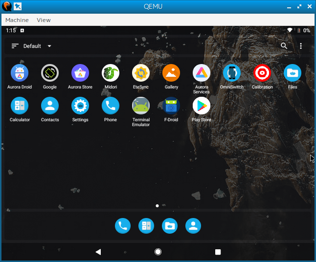
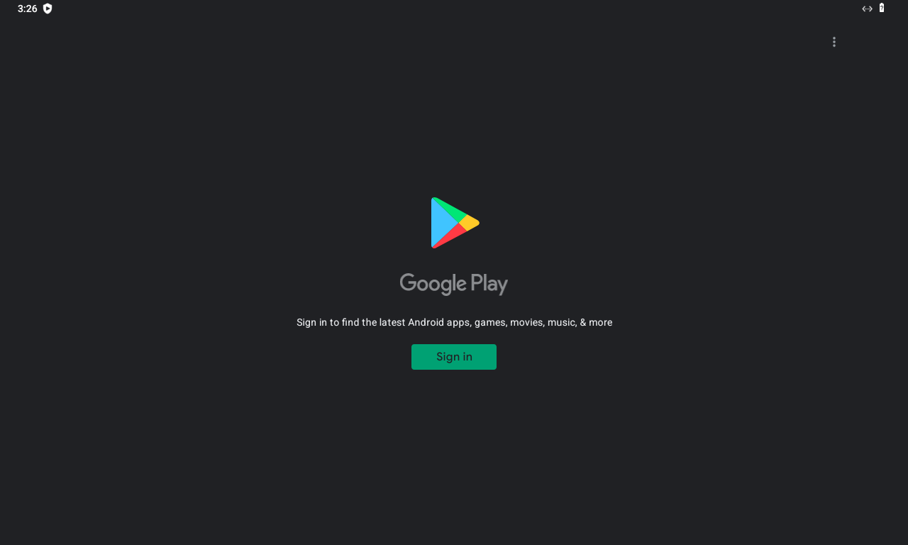
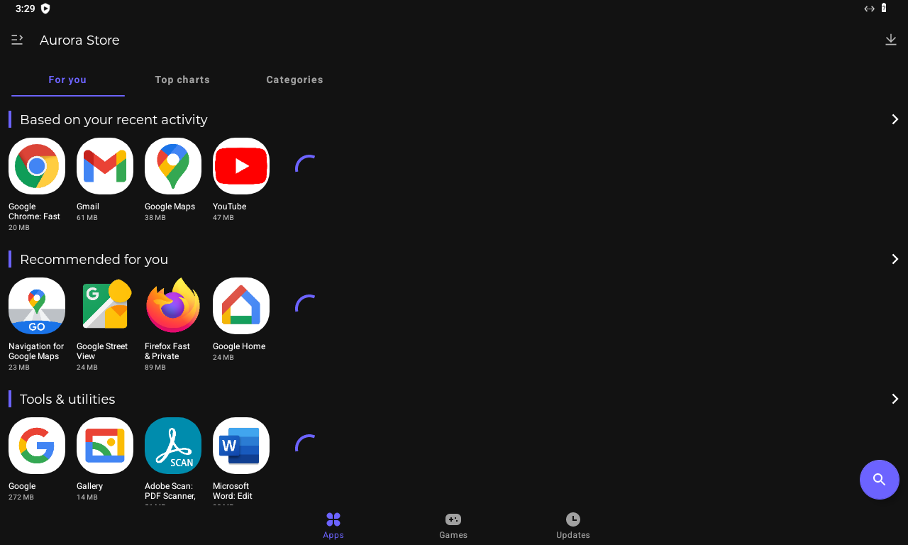
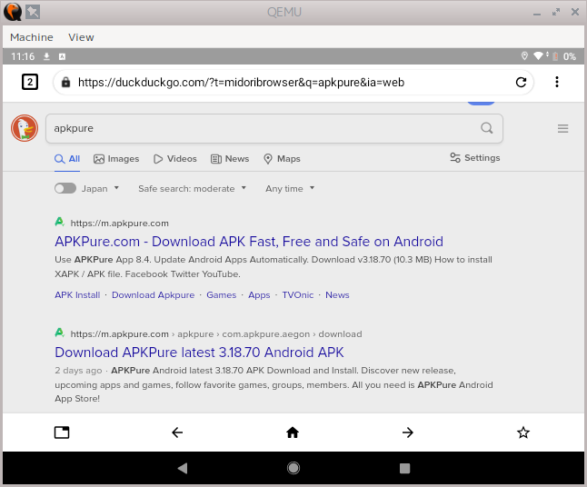
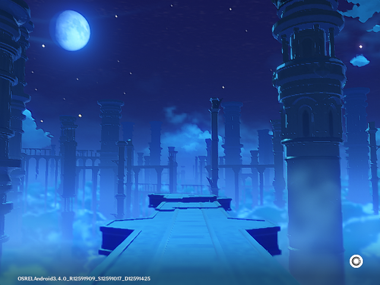

# Berry OS


[](https://github.com/yui0/berry-os/releases)
[](LICENSE)

The android emulator based on android-x86 environment via QEMU and VirGL with libhoudini support.

If you know some tips, please tell me.

## Features

* Android 9 Pie, Android 12 S
* x86-based
* Uses KVM
* Based on Android-x86 and Bliss OS
* libhoudini support (arm64, arm)
* Read + Write system
* [Open GApps](https://opengapps.org/), [MicroG](https://microg.org/download.html) support
* [Aurora Store](https://auroraoss.com/), [Aurora Dorid](https://f-droid.org/packages/com.aurora.adroid/) are pre-installed.
* Mini Desktop, [Midori](https://f-droid.org/ja/packages/org.midorinext.android/) are pre-installed.

## Download

* [RPM, Appimage](https://github.com/yui0/berry-os/releases)

## How to use AppImage

```
chmod +x berry-os-*-x86_64.AppImage
./berry-os-*-x86_64.AppImage
```

## How to install QEMU-VirGL on Fedora 37

```
dnf install \
qemu-ui-gtk \
qemu-system-x86-core \
qemu-device-display-virtio-vga-gl \
qemu-device-display-virtio-vga \
qemu-device-display-virtio-gpu-pci-gl \
qemu-device-display-virtio-gpu-pci \
qemu-device-display-virtio-gpu \
qemu-device-display-virtio-gpu-gl \
qemu-device-display-virtio-gpu-ccw \
qemu-audio-alsa \
virglrenderer

dnf install android-tools
```

## How to use

```
$ sudo rpm -Uvh berry-os*rpm
$ berry-os
```

* Connect Wi-Fi to VirtWifi
* If use MicroG, check Google device registration, Cloud Messaging, Google SafetyNet
* If needed, enable native bridge

## How to uninstall

- sudo rpm -e berry-os*rpm
- rm -rf ~/.local/share/berry-os/

## List of compatible applications

* Genshin Impact
* Houkai3rd
* Ys VI
* Dragonicle
* Knights Chronicle
* alice gear aegis
* Alchemia Story
* Caravan Stories
* Crash Fever
* Soul Destiny
* Abyss
* Epic Seven
* Echocalypse
* Guitar Girl
* Asphalt 9

* Arcaea
* Astral Fable
* AVABEL Online
* Evertale

## Screenshots








## Tips

- Enter debug mode
  - About tablet -> Build number (touch 7 times) -> Debug mode
- Screenshot
  - adb shell screencap -p > screen.png

```
# KMS
echo 1 > /sys/kernel/mm/ksm/run
```

```default.prop
ro.adb.secure=1
ro.secure=1
ro.debuggable=0
persist.sys.usb.config=mtp
```

```build.prop
ro.build.type=user
ro.product.model=Nexus S
ro.product.manufacturer=samsung

# Enable faster boot
ro.config.hw_quickpoweron=true

# Disable built-in error reporting
profiler.force_disable_err_rpt=1
profiler.force_disable_ulog=1
ro.kernel.android.checkjni=0
ro.kernel.checkjni=0

ro.config.nocheckin=1

# DNS
net.dns1=8.8.8.8
net.dns2=8.8.4.4

# for battery
pm.sleep_mode=2
ro.ril.disable.power.collapse=0
ro.semc.enable.fast_dormancy=true

# for memory
persist.sys.purgeable_assets=1

# Fix red border
persist.sys.strictmode.visual=0
persist.sys.strictmode.disable=1

# no SD card
ro.build.characteristics=nosdcard
```

```/vendor/build.prop
ro.config.low_ram=true
```

## ref.

* Android-x86
  * https://sourceforge.net/projects/blissos-dev/files/Android-Generic/PC/
  * https://www.android-x86.org/download
  * https://osdn.net/projects/android-x86/releases/67834
  * https://developer.android.com/topic/generic-system-image/releases
* houdini
  * https://github.com/tony-cloud/houdini9
  * https://threedots.ovh/blog/2020/12/houdini-run-arm-32-bit-and-64-bit-applications-on-an-x86_64-system/
  * https://github.com/m9rco/Genymotion_ARM_Translation
* QEMU
  * https://github.com/Gamesmes90/qemu-android-x86/blob/master/qemu-android
  * https://github.com/refutationalist/saur/blob/master/qemu-android-x86/qemu-android
* Open GApps
  * https://github.com/geeks-r-us/anbox-playstore-installer
* Bootanimations
  * https://forum.xda-developers.com/t/bootanimations-100-custom-flashable-bootanimations-for-all-resolutions.3059659/
* Other
  * https://github.com/TrinityEmulator/TrinityEmulator
  * https://github.com/openthos/openthos
  * https://github.com/cnrd/MagiskHide-Props-Config
  * https://gist.github.com/wuhx/bfd814bba5f2523449f1
